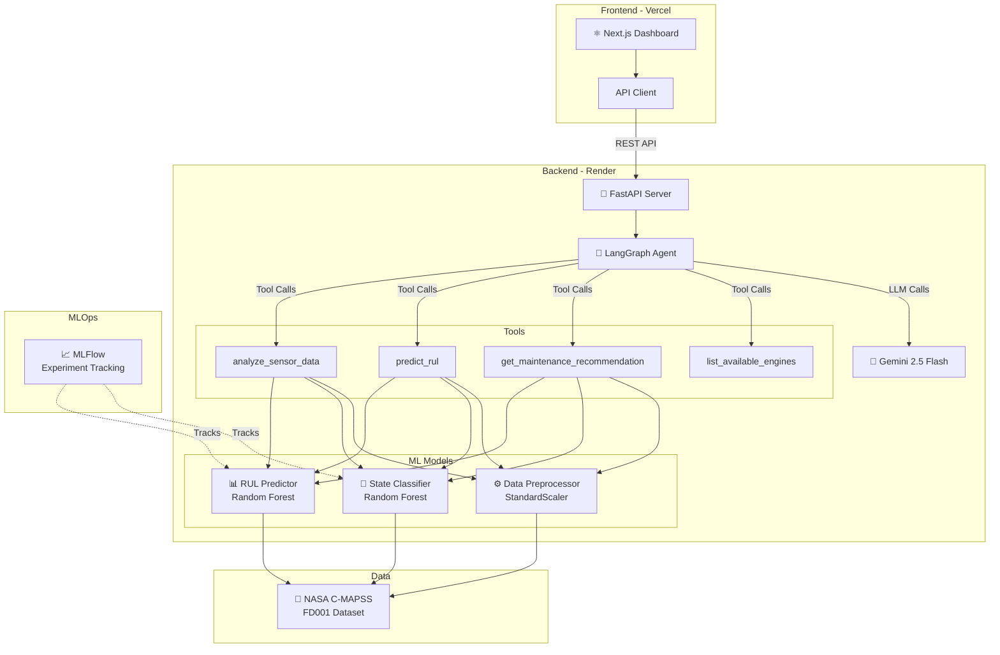
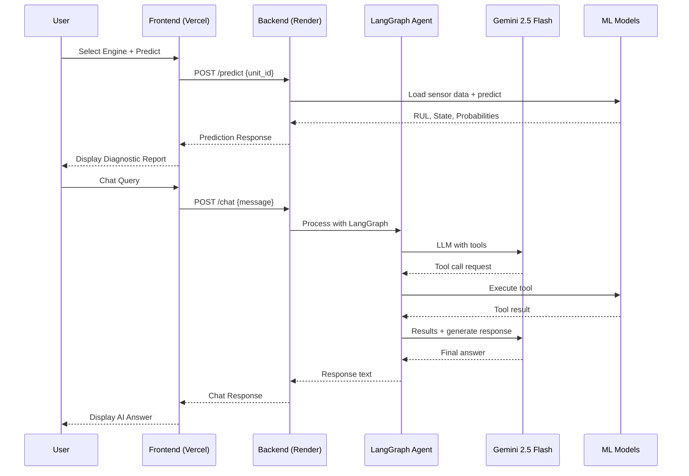
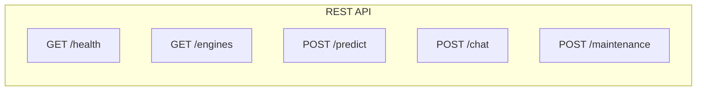
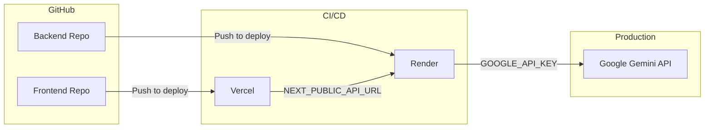

# 🏗️ System Architecture

## High-Level Architecture

```mermaid
graph TB
    subgraph "Frontend - Vercel"
        UI["⚛️ Next.js Dashboard"]
        API_CLIENT["API Client"]
    end
    
    subgraph "Backend - Render"
        FASTAPI["🚀 FastAPI Server"]
        AGENT["🤖 LangGraph Agent"]
        LLM["💬 Gemini 2.5 Flash"]
        
        subgraph "ML Models"
            RUL["📊 RUL Predictor<br/>Random Forest"]
            STATE["🔧 State Classifier<br/>Random Forest"]
            PREPROCESSOR["⚙️ Data Preprocessor<br/>StandardScaler"]
        end
        
        subgraph "Tools"
            T1["analyze_sensor_data"]
            T2["predict_rul"]
            T3["get_maintenance_recommendation"]
            T4["list_available_engines"]
        end
    end
    
    subgraph "Data"
        CMAPSS["📁 NASA C-MAPSS<br/>FD001 Dataset"]
    end
    
    subgraph "MLOps"
        MLFLOW["📈 MLFlow<br/>Experiment Tracking"]
    end
    
    UI --> API_CLIENT
    API_CLIENT -->|"REST API"| FASTAPI
    FASTAPI --> AGENT
    AGENT -->|"Tool Calls"| T1 & T2 & T3 & T4
    AGENT -->|"LLM Calls"| LLM
    T1 & T2 & T3 --> RUL & STATE & PREPROCESSOR
    RUL & STATE & PREPROCESSOR --> CMAPSS
    MLFLOW -.->|"Tracks"| RUL & STATE
```

## Data Flow

```mermaid
sequenceDiagram
    participant U as User
    participant FE as Frontend (Vercel)
    participant BE as Backend (Render)
    participant AG as LangGraph Agent
    participant GM as Gemini 2.5 Flash
    participant ML as ML Models
    
    U->>FE: Select Engine + Predict
    FE->>BE: POST /predict {unit_id}
    BE->>ML: Load sensor data + predict
    ML-->>BE: RUL, State, Probabilities
    BE-->>FE: Prediction Response
    FE-->>U: Display Diagnostic Report
    
    U->>FE: Chat Query
    FE->>BE: POST /chat {message}
    BE->>AG: Process with LangGraph
    AG->>GM: LLM with tools
    GM-->>AG: Tool call request
    AG->>ML: Execute tool
    ML-->>AG: Tool result
    AG->>GM: Results + generate response
    GM-->>AG: Final answer
    AG-->>BE: Response text
    BE-->>FE: Chat Response
    FE-->>U: Display AI Answer
```

## API Endpoints

```mermaid
graph LR
    subgraph "REST API"
        GET_HEALTH["GET /health"]
        GET_ENGINES["GET /engines"]
        POST_PREDICT["POST /predict"]
        POST_CHAT["POST /chat"]
        POST_MAINTAIN["POST /maintenance"]
    end
```

## Deployment Architecture

```mermaid
graph LR
    subgraph "GitHub"
        REPO_BE["Backend Repo"]
        REPO_FE["Frontend Repo"]
    end
    
    subgraph "CI/CD"
        REPO_BE -->|"Push to deploy"| RENDER["Render"]
        REPO_FE -->|"Push to deploy"| VERCEL["Vercel"]
    end
    
    subgraph "Production"
        VERCEL -->|"NEXT_PUBLIC_API_URL"| RENDER
        RENDER -->|"GOOGLE_API_KEY"| GEMINI["Google Gemini API"]
    end
```
