# 🏗️ System Architecture

## High-Level Architecture

```mermaid
graph TB
    subgraph "Frontend - Vercel"
        UI["⚛️ Next.js Dashboard<br/>AERO-SENSE Diagnostics"]
    end
    
    subgraph "Backend - Render"
        API["🚀 FastAPI Server"]
        AGENT["🤖 LangGraph Agent"]
        LLM["💬 Gemini 2.5 Flash"]
        
        subgraph "Tools"
            T1["analyze_sensor_data"]
            T2["predict_rul"]
            T3["get_maintenance_recommendation"]
            T4["list_available_engines"]
        end
        
        subgraph "ML Models"
            RUL["📊 RUL Predictor<br/>Random Forest"]
            STATE["🔧 State Classifier<br/>Random Forest"]
            PREP["⚙️ StandardScaler"]
        end
    end
    
    subgraph "Data & MLOps"
        DATA["📁 NASA C-MAPSS<br/>FD001 Dataset"]
        MLFLOW["📈 MLFlow<br/>Experiment Tracking"]
    end
    
    UI -->|REST API| API
    API --> AGENT
    AGENT -->|Tool Calls| T1 & T2 & T3 & T4
    AGENT <-->|LLM Calls| LLM
    T1 & T2 & T3 --> RUL & STATE & PREP
    RUL & STATE & PREP --> DATA
    MLFLOW -.->|Tracks| RUL & STATE
    
    style UI fill:#1e293b,stroke:#00f3ff,stroke-width:2px
    style API fill:#1e293b,stroke:#00f3ff,stroke-width:2px
    style AGENT fill:#1e293b,stroke:#00f3ff,stroke-width:2px
    style LLM fill:#1e293b,stroke:#a855f7,stroke-width:2px
```

## Request Flow

## Deployment Architecture

## Technology Stack

| Layer | Technology | Purpose |
|-------|-----------|---------|
| **Frontend** | Next.js | Cyberpunk UI dashboard |
| **API** | FastAPI | REST endpoints |
| **AI Orchestration** | LangGraph | Agent workflow |
| **LLM** | Gemini 2.5 Flash | Natural language + tool calling |
| **ML Models** | scikit-learn | RUL prediction + state classification |
| **MLOps** | MLFlow | Experiment tracking |
| **Data** | NASA C-MAPSS | Turbofan degradation dataset |
| **Deployment** | Render + Vercel | Backend + Frontend hosting |

---

**Note:** These Mermaid diagrams will render as visual flowcharts when viewed on GitHub.

